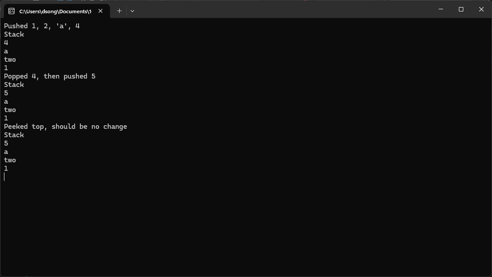

```cs
var stack = new Stack();
stack.Push(1);
stack.Push("two");
stack.Push('a');
stack.Push(4);
Console.WriteLine("Pushed 1, 2, 'a', 4");
stack.Display();

stack.Pop();
stack.Push(5);
Console.WriteLine("Popped 4, then pushed 5");
stack.Display();

stack.Peek();
Console.WriteLine("Peeked top, should be no change");
stack.Display();


Console.ReadKey();
```

